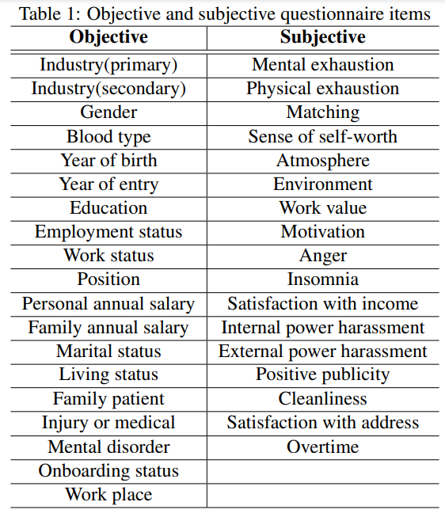
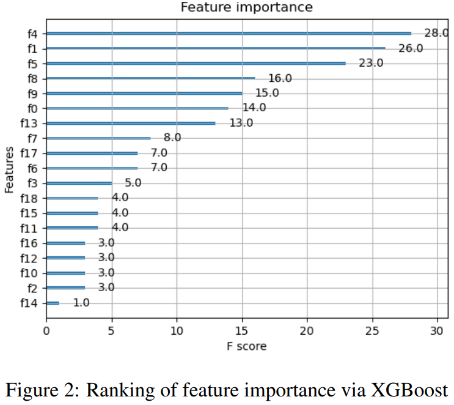
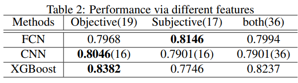
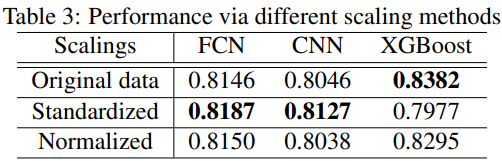
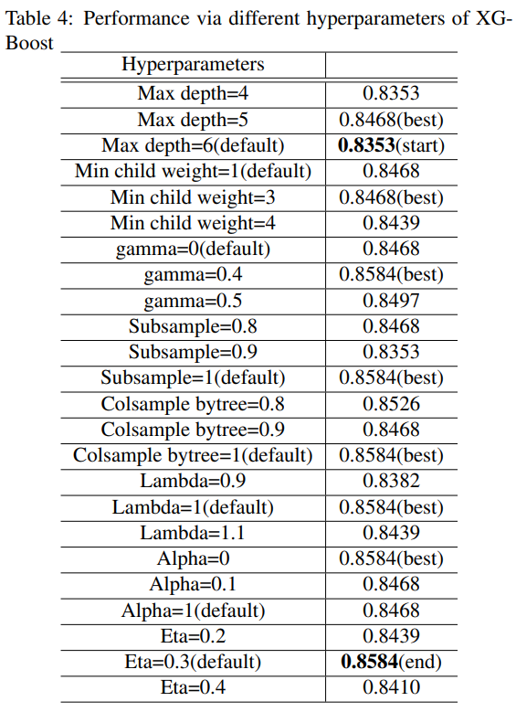

# EmployeeTurnoverRatePredictionViaMentalHealthData
In recent years, with the pressure brought by social development and the impact of Covid-19, the mental health of company employees has attracted much attention.

In this work, in order to grasp the mental state of employees in advance, we propose a method using data analysis, machine learning, deep learning to use employees' mental health data to predict the following tasks: 
```
1. Employee Turnover: whether they will leave the companies
2. Power Harassment: whether they are under the power harassment 
3. Matching between company and members: whether they are a good match for the companies
```

Our mental health data come from a large number of real questionnaire responses (more than 200 Japanese companies), such as the following features and labels.
```
Objective features: e.g. gender, blood type, birthday, year of employment, educational background, industry classification name, personal annual income, etc.

Subjective features: e.g. CompanyDistance (毎日の通勤でストレスを感じる), DepartmentSatisfaction (私の部署と他の部署とはうまが合わない), etc.

Labels: Employee Turnover (退職区分), Power Harassment (職場で自分がいじめにあっている), Matching between company and members (仕事の内容は自分にあっている)
```

There are some examples of important features below.




For allowing the model to better train and fit the data, this work leverages a variety of methods to preprocess the raw data. And, we conduct ablation study to compare the results via the different machine learning algorithms and different hyperparameters. In addition to our data, we also use the public dataset [IBM Open Data for HR Analytics](https://www.kaggle.com/datasets/pavansubhasht/ibm-hr-analytics-attrition-dataset) to verify our algorithm.






(TBD) We have written a paper titled "Predicting Employee Turnover Rate using Machine Learning Trained with Mental Health Data". However, since the data comes not only from our company, but also from more than 200 companies that conducted questionnaires. Therefore, our paper and data are not allowed to be made public (except the preprocessed data described in the data section later).


# Usage
### Dependencies
```
python=3.8
cudatoolkit=11.3
pytorch==1.12.1
torchvision==0.13.1
ipykernel
numpy
opencv-python
Pillow
matplotlib
scipy
pandas
scikit-learn
seaborn
imblearn
xgboost
featuretools
```

### Data
Although we cannot share the raw data due to privacy reasons, the preprocessed data used for training, validation, and testing is provided below. IBM open data can be downloaded [here](https://www.kaggle.com/datasets/pavansubhasht/ibm-hr-analytics-attrition-dataset).
```
data/Attrition/data_utf-8.csv
data/IMB_HR_employee_attrition.csv (for IBM open data)
data/Matching/data_utf-8.csv
data/PowerHarassment/data_utf-8.csv
```

### Train, validation and test

- Employee Turnover
```
3_Attrition.ipynb
3_Attrition_IBM.ipynb (for IBM open data)
```

- Power Harassment
```
4_PowerHarassment.ipynb
```

- Matching between company and members
```
5_Maching.ipynb
```


